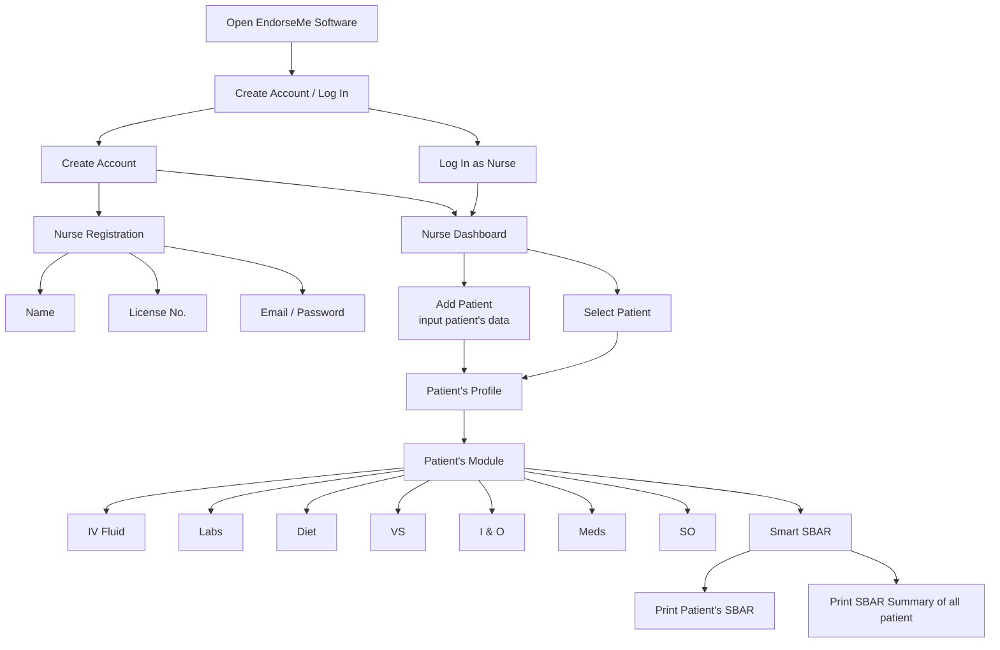

# EndorseMe
To standardize the endorsement process and make sure no important patient data is missed when shifting. It aims to solve the problem of messy or incomplete verbal reports that happen when the ward is too busy.

## Updated App Flow
- Open EndorseMe Software
- Create Account / Log In
  - Create Account (Nurse Registration: Name, License No., Email, Password)
  - Log In as Nurse
- Nurse Dashboard
  - Add Patient (input patient data)
  - Select Patient
- Patient's Profile
- Patient's Module
  - IV Fluid
  - Labs
  - Diet
  - VS
  - I & O
  - Meds
  - SO
- Smart SBAR
  - Print Patient SBAR
  - Print SBAR Summary of All Patients

## Flowchart (Mermaid)

